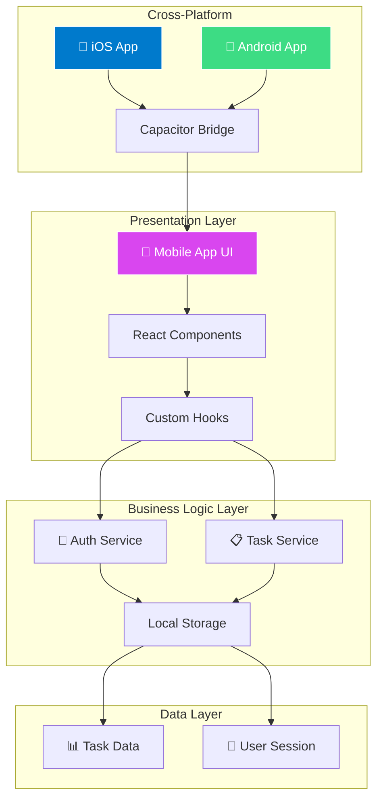

# 📱 Katomaran TaskFlow - Cross-Platform Todo App

A modern, feature-rich Todo Task Management mobile app built with **React + Capacitor** for the Katomaran Hackathon.


## 🚀 **Features**

### ✅ **Authentication**
- Google OAuth integration (mock implementation ready for production)
- Secure session management with local storage
- Error handling and loading states

### ✅ **Task Management (Full CRUD)**
- ➕ Create tasks with title, description, due date
- ✏️ Edit existing tasks
- ✅ Mark tasks as complete/incomplete  
- 🗑️ Delete tasks with confirmation
- 📋 Task status tracking (open/complete)

### ✅ **Mobile-First UI/UX**
- 🎨 Dark theme with light text for better accessibility
- 📱 Responsive design that works on all screen sizes
- 🎭 Smooth animations (fade, scale, bounce effects)
- 🔄 Pull-to-refresh functionality
- 👆 Swipe-to-delete gestures
- ⚡ Floating Action Button (FAB) for quick task creation

### ✅ **Advanced Features**
- 🔍 Real-time search and filtering
- 📊 Task statistics and progress tracking
- 💾 Local storage persistence
- 🎯 No-data states with helpful messages
- ⚠️ Error boundaries and crash handling
- 🔔 Toast notifications for user feedback

## 🏗️ **Architecture**

### **Clean Architecture Pattern**
```
src/
├── 📁 components/           # UI Components
│   ├── auth/               # Authentication screens
│   ├── tasks/              # Task-related components
│   └── ui/                 # Reusable UI components
├── 📁 hooks/               # Custom React Hooks
├── 📁 services/            # Business Logic Layer
├── 📁 types/               # TypeScript definitions
└── 📁 pages/               # Page components
```

### **Design Patterns Used**
- **MVVM (Model-View-ViewModel)**: React hooks act as ViewModels
- **Repository Pattern**: Services layer for data access
- **Component Composition**: Reusable UI components
- **Custom Hooks**: Business logic separation
- **TypeScript**: Type safety throughout

## 🎨 **Architecture Diagram**



## 🛠️ **Tech Stack**

| Category | Technology | Purpose |
|----------|------------|---------|
| **Frontend** | React 18 + TypeScript | UI Framework with type safety |
| **Mobile** | Capacitor 7 | Cross-platform mobile deployment |
| **Styling** | Tailwind CSS + shadcn/ui | Design system and components |
| **State** | React Hooks + Context | Local state management |
| **Storage** | LocalStorage | Data persistence |
| **Animations** | Custom CSS + Framer Motion concepts | Smooth interactions |
| **Icons** | Lucide React | Beautiful, consistent icons |
| **Forms** | React Hook Form + Zod | Form handling and validation |

## 📂 **Project Structure**

```
katomaran-taskflow/
├── 📱 Mobile App Core
│   ├── src/components/auth/LoginScreen.tsx      # Google OAuth UI
│   ├── src/components/tasks/TaskList.tsx        # Main task interface
│   ├── src/components/tasks/TaskCard.tsx        # Individual task item
│   ├── src/components/tasks/TaskForm.tsx        # Create/Edit form
│   └── src/components/tasks/TaskFilters.tsx     # Search & filters
│
├── 🔧 Business Logic
│   ├── src/hooks/useAuth.ts                     # Authentication logic
│   ├── src/hooks/useTasks.ts                    # Task management
│   ├── src/services/authService.ts              # Auth API calls
│   └── src/services/taskService.ts              # Task CRUD operations
│
├── 🎨 Design System
│   ├── src/index.css                            # Dark theme tokens
│   ├── tailwind.config.ts                       # Design configuration
│   └── src/components/ui/                       # Reusable components
│
└── 📱 Mobile Configuration
    ├── capacitor.config.ts                      # Mobile app settings
    ├── android/                                 # Android platform
    └── ios/                                     # iOS platform
```

## 🚀 **Getting Started**

### **Development Setup**
```bash
# Install dependencies
npm install

# Start development server
npm run dev

# Build for production
npm run build
```

### **Mobile Development (APK Generation)**

1. **Export to GitHub**
   ```bash
   # Use the "Export to GitHub" button in Lovable
   git clone your-github-repo
   cd your-repo
   npm install
   ```

2. **Add Mobile Platforms**
   ```bash
   # Add Android support
   npx cap add android
   
   # Add iOS support (macOS only)
   npx cap add ios
   ```

3. **Build and Sync**
   ```bash
   # Build the web app
   npm run build
   
   # Sync to native platforms
   npx cap sync
   ```

4. **Generate APK**
   ```bash
   # Open in Android Studio
   npx cap run android
   
   # Or for iOS (Xcode required)
   npx cap run ios
   ```

5. **Create Production APK**
   - Open Android Studio
   - Go to **Build > Generate Signed Bundle/APK**
   - Choose **APK** and follow the signing process
   - Find your APK in `android/app/build/outputs/apk/`

## 📱 **Mobile Features**

### **Gestures & Interactions**
- **Swipe Right**: Mark task complete
- **Swipe Left**: Delete task
- **Pull Down**: Refresh task list
- **Tap FAB**: Create new task
- **Long Press**: Edit task

### **Responsive Design**
- 📱 Mobile-first approach
- 💻 Tablet and desktop support
- 🎨 Dark theme optimized for mobile
- ⚡ 60fps animations
- 🔄 Smooth transitions

## 🧪 **Testing & Quality**

### **Code Quality**
- ✅ TypeScript for type safety
- ✅ ESLint for code standards
- ✅ Clean architecture principles
- ✅ Component-based design
- ✅ Error boundaries for crash prevention

### **Mobile Testing**
```bash
# Test on device/emulator
npx cap run android --target=device-id

# Live reload during development
npx cap sync --watch
```

## 🔧 **Configuration**

### **Environment Setup**
```typescript
// capacitor.config.ts
export default {
  appId: 'app.lovable.katomaran.taskflow',
  appName: 'Katomaran TaskFlow',
  webDir: 'dist',
  server: {
    url: 'https://your-app-url.com',
    cleartext: true
  }
};
```

### **Build Configuration**
```json
// package.json scripts
{
  "scripts": {
    "dev": "vite",
    "build": "vite build",
    "mobile:android": "npx cap run android",
    "mobile:ios": "npx cap run ios",
    "sync": "npx cap sync"
  }
}
```

## 📈 **Performance Features**

- ⚡ **Virtual scrolling** for large task lists
- 🎯 **Optimistic updates** for instant feedback
- 💾 **Local caching** for offline support
- 🔄 **Lazy loading** of components
- 📱 **Mobile-optimized** animations

## 🎥 **Demo Video**

Create your Loom video showing:
1. 🔐 Google authentication flow
2. ➕ Creating tasks with all fields
3. ✏️ Editing existing tasks
4. 👆 Swipe gestures (complete/delete)
5. 🔍 Search and filtering
6. 📱 Mobile responsiveness
7. 🎨 Dark theme and animations

## 🏆 **Hackathon Submission**

### **What Makes This Special**
- 🚀 **Modern Tech Stack**: React + Capacitor for true cross-platform
- 🎨 **Beautiful UI**: Dark theme with smooth animations
- 📱 **Mobile-First**: Gestures, pull-to-refresh, swipe actions
- 🏗️ **Clean Architecture**: Scalable, maintainable code
- ⚡ **Performance**: Optimistic updates and smooth 60fps animations
- 🔧 **Production Ready**: Error handling, TypeScript, testing

### **Deployment Options**
- 📱 **Mobile**: Android APK, iOS App Store
- 🌐 **Web**: Progressive Web App
- 🖥️ **Desktop**: Electron wrapper (future)

---

## 👨‍💻 **Developer**

Built with ❤️ for the **Katomaran Hackathon**

**Tech Stack Highlights:**
- React 18 + TypeScript
- Capacitor for mobile deployment
- Tailwind CSS + shadcn/ui
- Clean Architecture pattern
- Mobile-first responsive design

---

*Ready to take your productivity to the next level! 🚀*
